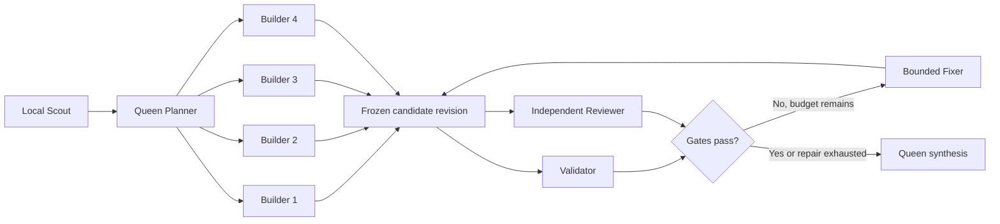
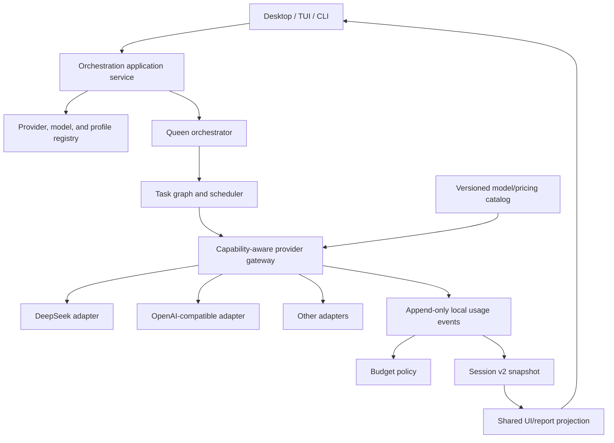

# HIVE DeepSeek V4 Flash multi-orchestration redesign

Date: 2026-07-18  
Status: Proposed implementation plan  
Primary surface: Windows desktop command center  
Parity surfaces: CLI and TUI  

## Outcome

Evolve the existing HIVE desktop companion into an agent command center comparable in interaction quality to modern coding-agent products while preserving HIVE's own verified-engineering identity and safety model.

The recommended product shape is:

- one canonical Queen orchestration runtime shared by desktop, TUI, and non-interactive CLI;
- multi-agent orchestration enabled for every normal coding run by default;
- editable orchestration profiles that choose roles, providers, models, concurrency, reasoning settings, fallbacks, approvals, retries, and budgets;
- first-class DeepSeek V4 Flash support without making the provider layer DeepSeek-specific;
- provider, model, route, token, cache, latency, and estimated-cost evidence visible before, during, and after each run;
- secure BYOK and arbitrary OpenAI-compatible endpoints, with credentials kept out of repository files, process arguments, events, reports, and renderer persistence;
- the existing isolated-worktree, review, validation, explicit-approval, and guarded-Git behavior retained.

HIVE should not become a full text editor in this phase. The Electron app already has the safer and smaller foundation: project/thread navigation, a conversation, an activity inspector, read-only diffs, secure credentials, and open-in-editor actions. A future IDE extension should consume the same application contracts instead of creating another orchestration engine.

## Current-code review

### Foundations to keep

| Existing capability | Evidence | Decision |
| --- | --- | --- |
| Canonical Queen coding runtime | `src/coding/runtime.ts`, `src/coding/queen.ts` | Keep as the only new-session runtime. |
| Bounded task DAG and parallel builders | `src/coding/planner.ts`, `src/coding/task-graph.ts`, `src/coding/scheduler.ts` | Extend through profiles and explicit stage contracts. |
| Provider routing with project/global precedence and fallbacks | `src/coding/provider-router.ts` | Keep the precedence model; replace role JSON with a versioned profile layer. |
| Per-task provider/model and basic token persistence | `src/coding/types.ts`, `src/coding/report.ts` | Expand to per-request usage and pricing provenance. |
| Worktree isolation and guarded Git | `src/worktree.ts`, `src/desktop/guarded-git-service.ts` | Preserve unchanged as the mutation boundary. |
| Electron process isolation and encrypted desktop credentials | `src/desktop/electron/*`, `src/desktop/credential-vault.ts` | Reuse; add provider/profile metadata only. |
| Durable runtime events and sessions | `src/coding/events.ts`, `src/coding/session-store.ts` | Introduce compatible v2 readers/writers rather than a second store. |

### Gaps that block the requested experience

1. **Configuration is present but fragmented.** `hive code` accepts role flags and defaults to `auto`, four agents, and two retries, while the TUI and desktop hard-code their own `auto` settings. There is no named, inspectable orchestration profile shared across surfaces.
2. **The desktop selects one provider for the entire run.** `DesktopRunOptions` carries only one provider/model pair, and the renderer submits that provider for all roles. The role-specific CLI capability is not represented in desktop contracts or UI.
3. **The workflow is only partly parallel.** Independent Builder tasks can fan out, but Validator runs first and Reviewer explicitly depends on Validator. There is no final model-assisted Queen synthesis over independent validation and review evidence.
4. **The product has two coding paths.** `hive run` still uses the legacy `CoderOrchestrator`; `hive code`, TUI, and desktop use the Queen runtime. This creates inconsistent defaults, reports, provider behavior, and future migration work.
5. **Desktop providers are a fixed built-in list.** The app can edit the endpoint only for an existing `openai-compatible` entry, with HIVE Cloud-specific labels. Users cannot add, clone, remove, discover, or manually define arbitrary provider/model entries from the desktop.
6. **The generic compatible adapter is too narrow for DeepSeek V4.** It sends only non-streaming `model` and `messages`, reads only content and three aggregate token fields, and has no thinking mode, reasoning effort, JSON mode, native tools, cache-hit/miss usage, reasoning-token usage, finish reason, request ID, latency, or streamed usage support.
7. **Cost is intentionally unavailable.** The versioned run report already has monetary contracts, but every provider and agent cost is projected as unavailable because no pricing snapshot is persisted.
8. **Stored usage is not visible at the point of work.** TUI state can receive `tokenUsage`, but the subagent panel does not render it. The desktop Agent list reduces events to ID/status, and its report tab uses the compact `CodingFinalReport`, not the richer `HiveRunReport` usage projection.
9. **Provider concurrency is not a real provider setting.** Queen assigns every provider the run-wide `maxAgents` value. There is no per-provider cap, 429-aware queue, cooldown, or account-level capacity policy.
10. **One active desktop run per repository is a deliberate v1 restriction.** Keep this restriction for the first redesign. The requested default multi-orchestration occurs inside the run. Multi-run concurrency in one repository should be a separate later project after worktree ownership and UX are re-audited.

## DeepSeek V4 Flash compatibility facts

The implementation must use current official identifiers and make pricing versioned rather than timeless.

- OpenAI-format base URL: `https://api.deepseek.com`
- Model ID: `deepseek-v4-flash`
- Legacy aliases `deepseek-chat` and `deepseek-reasoner` are scheduled for retirement on 2026-07-24 at 15:59 UTC. New configuration must never emit them.
- Context window: 1,000,000 tokens
- Maximum output: 384,000 tokens
- Thinking mode: enabled by default; supported effort values are `high` and `max`
- JSON output and tool calls: supported
- Usage fields include prompt, completion, total, cache-hit input, cache-miss input, and reasoning-token detail
- Current Flash prices per 1M tokens: USD 0.0028 cache-hit input, USD 0.14 cache-miss input, and USD 0.28 output
- Current account concurrency limit: 2,500 requests, but HIVE should use a much lower local default because repository tools, file ownership, budgets, and rate recovery are the actual constraints.

Official references:

- [DeepSeek first API call](https://api-docs.deepseek.com/)
- [Models and pricing](https://api-docs.deepseek.com/quick_start/pricing)
- [Thinking mode](https://api-docs.deepseek.com/guides/thinking_mode)
- [Chat completion contract](https://api-docs.deepseek.com/api/create-chat-completion/)
- [Context caching](https://api-docs.deepseek.com/guides/kv_cache)

DeepSeek requires `reasoning_content` to be returned across native tool-call rounds in thinking mode. HIVE must keep that protocol state inside the active provider loop, never show it as a reasoning transcript, and never write it to ordinary session events or reports. Pause boundaries should remain outside an in-flight tool loop; a crash retries the bounded task from its last durable boundary.

## Product design

### Benchmark principles, not copied layouts

Use established product behaviors as benchmarks while keeping HIVE's own Queen, verified-engineering, violet, worktree, and guarded-approval identity:

- Cline keeps provider/model setup in-product, supports BYOK and OpenAI-compatible base URLs, and exposes task token/cost totals. HIVE should match that clarity but extend it to a visible role matrix and multi-agent total. See [Cline authorization and model selection](https://docs.cline.bot/getting-started/authorizing-with-cline), [OpenAI-compatible provider setup](https://docs.cline.bot/provider-config/openai-compatible), and [task cost tracking](https://docs.cline.bot/core-workflows/task-management).
- Codex treats the desktop product as a command center for project threads, parallel agents, isolated worktrees, diff review, and open-in-editor continuation, with configuration shared across local surfaces. HIVE should follow the command-center principle while retaining its local/BYOK and explicit guarded-Git posture. See [Introducing the Codex app](https://openai.com/index/introducing-the-codex-app/) and [Codex CLI and IDE updates](https://openai.com/index/introducing-upgrades-to-codex/).

Do not copy names, layouts, assets, or source. The benchmark is point-of-use clarity, shared configuration, evidence visibility, and safe supervision.

### Primary interaction model

Retain the current three-region desktop shell, but change its hierarchy:

```text
┌ Projects / Threads ┬ Run workspace                         ┬ Orchestration inspector ┐
│ repository         │ objective, plan, conversation         │ profile + live DAG       │
│ active runs        │ agent updates, approvals, diff        │ role/provider/model      │
│ completed runs     │ persistent composer                   │ tokens/cost/budget       │
│                    │                                       │ validation/review/Git    │
└────────────────────┴───────────────────────────────────────┴─────────────────────────┘
  Composer: [Orchestrate: Flash Swarm] [4 agents] [DeepSeek V4 Flash] [$0.08 / $1.00]
```

The center remains task-first, not dashboard-first. Advanced detail stays in the inspector or a drawer. The provider/model/profile/budget summary must remain visible next to the composer before submission so routing is never hidden.

### First-run setup

1. Choose a preset provider: DeepSeek, OpenAI, Anthropic, OpenRouter, Ollama, or Custom compatible endpoint.
2. Choose credential source: encrypted desktop vault, environment-variable reference, or no authentication for an approved local endpoint.
3. Enter or discover the model. For DeepSeek, preselect `deepseek-v4-flash`.
4. Run a no-cost `/models` check where supported. Require explicit consent before a paid completion health check.
5. Choose an orchestration preset and inspect its role matrix.
6. Choose a run warning budget, hard cap, approval policy, and maximum concurrency.
7. Show one confirmation page with endpoint, auth source, model, roles, fallbacks, prices and price timestamp, and safety policy. Never echo the secret.

### Orchestration presets

- **Flash Swarm — default:** DeepSeek V4 Flash for all model-backed roles, four concurrent Builders, thinking `max` for planning/review and `high` elsewhere.
- **Quality Council:** a stronger model for planning, review, and synthesis; Flash for parallel builders and validation.
- **Economy:** two builders, tighter context/output budgets, Flash `high`, fewer repair cycles.
- **Custom:** per-stage providers/models, a Builder pool, fallbacks, concurrency, reasoning, token limits, cost limits, and approvals.

Every preset is copied to an editable profile. The UI must show whether a value comes from the built-in default, global profile, project override, or one-run override.

### Point-of-use visibility

Before a run:

- profile name and topology;
- role-to-provider/model matrix;
- pricing source and timestamp;
- warning and hard budget;
- approval policy, maximum agents, and fallback behavior;
- capability warnings before submission.

During a run:

- stage/DAG progress and dependencies;
- agent ID, role, status, provider, model, attempt, elapsed time, file scope, context use, input/output/cache/reasoning tokens, and estimated cost;
- selected route and explicit fallback receipts;
- run totals, budget remaining, cache savings, and rate-limit/cooldown status;
- concise “thinking” or “waiting for provider” status without private reasoning content.

After a run:

- final Queen synthesis, validation and review disagreements, changed files, commands, and outstanding risks;
- per-agent and aggregate usage/cost with provenance;
- pricing snapshot used for the estimate;
- exportable JSON and Markdown reports using the same projection shown in the UI.

## Default DeepSeek V4 Flash profile

This is the launch recommendation; pilot telemetry may tune the numerical limits without changing the schema.

```json
{
  "schemaVersion": 1,
  "id": "deepseek-flash-swarm",
  "name": "Flash Swarm",
  "workflow": "queen-dag-evaluator",
  "default": true,
  "stages": {
    "scout": { "executor": "local" },
    "planner": {
      "providerId": "deepseek",
      "modelId": "deepseek-v4-flash",
      "thinking": "enabled",
      "reasoningEffort": "max"
    },
    "builder": {
      "providerId": "deepseek",
      "modelId": "deepseek-v4-flash",
      "thinking": "enabled",
      "reasoningEffort": "high",
      "poolSize": 4
    },
    "validator": {
      "providerId": "deepseek",
      "modelId": "deepseek-v4-flash",
      "thinking": "enabled",
      "reasoningEffort": "high"
    },
    "reviewer": {
      "providerId": "deepseek",
      "modelId": "deepseek-v4-flash",
      "thinking": "enabled",
      "reasoningEffort": "max"
    },
    "fixer": {
      "providerId": "deepseek",
      "modelId": "deepseek-v4-flash",
      "thinking": "enabled",
      "reasoningEffort": "high"
    },
    "synthesis": {
      "providerId": "deepseek",
      "modelId": "deepseek-v4-flash",
      "thinking": "enabled",
      "reasoningEffort": "high"
    }
  },
  "limits": {
    "maxConcurrency": 4,
    "maxTasks": 12,
    "maxDepth": 2,
    "maxRetries": 2,
    "providerConcurrency": { "deepseek": 4 },
    "warnEstimatedCostUsd": "0.25",
    "hardEstimatedCostUsd": "1.00"
  },
  "approvalPolicy": "changes"
}
```

The runtime choreography is:



Validator and Reviewer must be read-only and run concurrently against the same immutable candidate revision. The repair decision waits for both. A Fixer receives only bounded evidence and file scope, then both gates rerun. Final synthesis waits for all terminal evidence and must preserve disagreements instead of rewriting them as consensus.

### Agent handoff contract

Every edge in the workflow uses one versioned, validated `AgentHandoffV1` payload. Passing an entire upstream transcript or mutable session object is prohibited.

Minimum fields:

- `workflowId` and `sessionId`;
- `fromStepId`, `toStepId`, and `taskId`;
- bounded task/objective and constraints;
- exact repository/worktree and candidate-revision references;
- exact file scope and write/read-only authority;
- upstream artifact references plus short evidence summaries;
- expected output and measurable completion criteria;
- validation commands or review rubric where applicable;
- provider/model route snapshot;
- remaining token and estimated-cost budgets;
- timeout, attempt, and retry policy;
- schema version and creation timestamp.

Builder handoffs receive only Scout/Planner evidence relevant to their file scope. Validator and Reviewer receive the same candidate-revision ID and cannot write. Fixer receives failed checks/findings plus bounded scopes, not raw hidden reasoning. Synthesis receives terminal structured artifacts, usage receipts, and unresolved disagreements. Every handoff is persisted after redaction so resume and audit use the same contract.

## Target technical architecture



### Configuration contracts

Add versioned, validated contracts rather than adding more loose fields:

- `ProviderConnectionV2`: ID, display name, protocol, normalized base URL, auth method, credential reference, custom non-secret headers, discovery policy, health state, and scope.
- `ModelCatalogEntryV1`: provider/model ID, display name, context/output limits, capabilities, pricing, source URL, effective timestamp, and provenance.
- `OrchestrationProfileV1`: workflow, stages, target pools, role settings, fallback chains, concurrency, retry, token/cost budgets, and approval policy.
- `OrchestrationSnapshotV1`: the fully resolved immutable profile persisted for a run.
- `ProviderRequestUsageV1`: one normalized record per provider request, including role, task, attempt, request ID, route, model, tokens, cache split, reasoning subset, latency, pricing snapshot, estimate, and provenance.

Precedence remains explicit:

`one-run override > project profile > global profile > built-in default`

Secrets never participate in precedence as values. Only credential references do.

### Provider gateway and DeepSeek adapter

Extend the request/response boundary before editing the UI:

- typed message history and optional tools;
- `thinking: enabled|disabled` and `reasoningEffort: high|max` only when supported;
- JSON response mode for Planner, Reviewer, and synthesis schemas;
- streaming with final usage chunks;
- finish reason, provider request ID, response model, latency, and detailed usage;
- abort, timeout, retry-after, 429 cooldown, and bounded response sizes;
- adapter capability declaration and preflight validation;
- route receipts for primary/fallback attempts.

Create a dedicated `deepseek` provider kind/preset even though its wire format is compatible. This isolates DeepSeek-specific thinking, cache, reasoning, deprecation, and pricing behavior while retaining the generic adapter for custom endpoints.

Keep the current structured textual tool loop for the first compatible release. Native function calling should be enabled behind an adapter capability after the continuation-state and crash/retry tests are green. Raw `reasoning_content` must remain in-memory protocol state and must not enter `RuntimeEvent`, `ThreadMessage`, normal logs, diffs, or reports.

### Usage and estimated cost

Replace three optional token fields with a normalized detailed usage object while retaining a v1 projection:

- prompt/input tokens;
- cache-hit input tokens;
- cache-miss input tokens;
- completion/output tokens;
- reasoning tokens as a subset of completion tokens;
- total tokens;
- provider request ID and model;
- latency and finish reason.

For DeepSeek V4 Flash:

`estimated cost = hit_input × 0.0028 / 1M + miss_input × 0.14 / 1M + completion × 0.28 / 1M`

Do not charge reasoning tokens twice; they are displayed as a completion-token detail. Use fixed-scale integer math internally and decimal strings in JSON. Never use floating point for persisted money. Every estimate carries `pricingSnapshotId`, `effectiveAt`, `source`, `currency`, and `billingGrade: false`.

Costs must be labeled **Estimated BYOK cost** unless a provider returns an authoritative charge. Pricing can change, so the shipped catalog is an offline snapshot and the UI must show its age. Unknown custom-model prices remain unavailable until the user supplies a versioned price override; unavailable must never become zero.

Emit provider-request and usage events as each call ends so live totals are not delayed until an agent completes. The budget policy checks before starting the next paid request. It does not terminate an already accepted provider response halfway through solely because an estimate crossed the threshold.

### Custom URLs and BYOK

Desktop provider management needs Add, Edit, Test, Duplicate, Disable, and Remove actions. The custom flow asks for protocol, base URL, auth type, credential, model discovery/manual model, and optional capability/pricing overrides.

URL rules:

- accept HTTPS endpoints and explicitly approved HTTP loopback/local endpoints;
- reject embedded username/password, fragments, and credential-like query parameters;
- normalize trailing slashes but preserve required path prefixes such as `/v1`;
- do not forward an authorization header across a cross-origin redirect;
- use strict timeouts and response-size limits for discovery and health checks;
- treat `GET /models` as optional; allow a manually entered model when discovery is unsupported;
- require consent before a health check that creates billable tokens.

Desktop credentials continue through Electron `safeStorage`. CLI configuration defaults to environment-variable references or a hidden interactive prompt with no secret command-line flag. Non-secret provider/profile configuration is shared; credential resolution remains surface-specific behind one interface.

## CLI and TUI design

Keep `hive` as the interactive TUI and make all non-interactive commands scriptable with `--json`.

Proposed commands:

```text
hive setup
hive providers list|add|edit|test|remove
hive models list [--provider <id>]
hive orchestration list|show|create|edit|use
hive code "<objective>" [--profile <id>]
hive usage [<session-id>] [--json]
hive report <session-id> [--json|--markdown]
```

Compatibility:

- route new `hive run` sessions through the canonical `hive code` application service;
- keep the old syntax as a deprecated alias for at least one release;
- preserve `--provider/--model` and role flags as one-run overrides;
- add `--profile`, `--budget`, and `--max-agents` without making flags the primary setup method;
- reject secrets supplied as literal CLI arguments and direct users to environment, stdin, prompt, or secure storage.

TUI additions:

- a persistent run header with profile, agent count, provider/model, tokens, estimated cost, and budget;
- `/orchestration`, `/providers`, `/models`, and `/usage` views;
- an expanded agent table with usage/cost columns and a compact narrow-terminal projection;
- a preflight screen before the first run when no valid default profile exists;
- the same route, fallback, budget, and capability warnings as desktop.

## Desktop redesign

Split the current monolithic renderer into focused components without changing the Electron trust boundary:

- `RunComposer`: objective plus profile/provider/budget chips;
- `OrchestrationGraph`: stage dependencies, state, and fan-out/fan-in;
- `AgentTable` and `AgentDetails`: role, route, scope, activity, usage, cost, and evidence;
- `UsageMeter`: run totals, cache savings, pricing age, warning/hard budget;
- `ProviderManager`: presets, arbitrary endpoints, model discovery, BYOK, health and capability checks;
- `ProfileEditor`: presets and per-role/provider/model configuration;
- `RunReportView`: render `HiveRunReport`, not a separate compact usage-less shape;
- existing Conversation, Diff, validation/review, pause/cancel, and guarded-Git components remain.

On narrow windows, the left and right regions become drawers. The composer and run header remain visible. Provider/model/cost information must not disappear behind hover-only UI. All graphs also need a semantic list/table representation for keyboard and screen-reader users.

## Implementation phases

### Phase 0 — Baseline, contracts, and compatibility

Files:

- `src/coding/types.ts`
- `src/coding/session-store.ts`
- `src/desktop/types.ts`
- `src/desktop/electron/contracts.ts`
- new `src/orchestration/types.ts`
- new migration tests

Work:

1. Capture current CLI/TUI/desktop and Queen behavior with focused regression tests.
2. Define provider/model/profile/orchestration/usage contracts and exact validators.
3. Add session v1 read compatibility and a v2 writer. Never rewrite a v1 snapshot merely because it was inspected.
4. Add desktop-state and provider-config migration with original-file preservation on failure.
5. Add a canonical application-service interface used by every surface.

Gate:

- existing v1 sessions, reports, provider configs, and desktop state still load;
- corrupt and unsupported data remains preserved;
- no secret-bearing field is accepted by a persistence or event contract.

### Phase 1 — Provider/model foundation and DeepSeek V4 Flash

Files:

- `src/providers/types.ts`
- `src/providers/registry.ts`
- `src/providers/store.ts`
- `src/providers/health.ts`
- `src/providers/adapters/openai-compatible.ts`
- new `src/providers/adapters/deepseek.ts`
- new `src/providers/model-catalog.ts`
- new `src/providers/url-policy.ts`
- provider tests and a local fake Chat Completions server

Work:

1. Add `deepseek` preset metadata, official base URL, model ID, capabilities, and timestamped pricing.
2. Extend normalized completion requests and responses for thinking, JSON mode, streaming, finish data, detailed usage, and rate errors.
3. Parse DeepSeek cache and reasoning token fields.
4. Add model discovery with manual fallback and capability validation.
5. Add explicit migration guidance for legacy `deepseek-chat` and `deepseek-reasoner`; map them only for a confirmed DeepSeek connection and preserve thinking semantics.
6. Harden custom endpoint and redirect behavior.

Gate:

- deterministic adapter tests cover success, streaming usage, JSON, cache splits, errors, 429/retry-after, cancellation, malformed bodies, and secret redaction;
- an optional live smoke test runs only when `DEEPSEEK_API_KEY` is deliberately supplied;
- new configuration uses `deepseek-v4-flash` exclusively.

### Phase 2 — Usage ledger, pricing, and budgets

Files:

- new `src/coding/usage.ts`
- `src/coding/events.ts`
- `src/coding/report.ts`
- `src/coding/provider-router.ts`
- `src/coding/types.ts`
- usage/cost tests

Work:

1. Emit one immutable normalized usage event per provider request and attempt.
2. Add fixed-scale decimal cost math and pricing snapshots.
3. Aggregate request → agent → stage → session without double counting retries or reasoning tokens.
4. Add warning/hard budget events and pre-request enforcement.
5. Project the same usage source into JSON, Markdown, TUI, and desktop.

Gate:

- exact cost vectors cover hit/miss/output combinations, retries, partial/unavailable usage, and price changes;
- every displayed cost includes provenance and snapshot age;
- unknown usage/cost remains unavailable, never zero.

### Phase 3 — Configurable default multi-orchestration

Files:

- new `src/orchestration/profiles.ts`
- `src/coding/queen.ts`
- `src/coding/planner.ts`
- `src/coding/scheduler.ts`
- `src/coding/runtime.ts`
- `src/coding/provider-router.ts`
- orchestration tests

Work:

1. Resolve and persist the effective profile before the first provider call.
2. Make Flash Swarm the default only after its provider/model preflight passes; otherwise block with a setup action rather than silently choosing a different model.
3. Support Builder pools and per-provider concurrency.
4. Run Validator and Reviewer concurrently against one frozen candidate revision.
5. Add a bounded repair decision and final Queen synthesis.
6. Make fallbacks explicit per role and persist every route attempt.
7. Route `hive run`, `hive code`, TUI, and desktop through this one application service.

Gate:

- a default run proves at least Planner, multiple Builders where the plan permits, Validator, Reviewer, and synthesis are distinct tasks/calls;
- overlapping file scopes serialize; independent scopes parallelize;
- validation and review start only after all required builders and share the same candidate revision;
- synthesis waits for both gates and preserves disagreement;
- budget, cancellation, pause, resume, and fallback behavior remain deterministic.

### Phase 4 — Desktop provider/profile setup and live command center

Files:

- `src/desktop/types.ts`
- `src/desktop/electron/app-state.ts`
- `src/desktop/electron/router.ts`
- `src/desktop/electron/worker-credential.ts`
- `desktop/renderer/src/App.tsx`
- new renderer components under `desktop/renderer/src/components/`
- `desktop/renderer/src/state.ts`
- `desktop/renderer/src/styles.css`
- renderer, IPC, credential, and E2E tests

Work:

1. Add provider CRUD, DeepSeek preset, custom URL, model discovery/manual model, and secure BYOK flows.
2. Add profile preset/editor and preflight summary.
3. Add run-header, DAG, role matrix, agent details, and usage/budget projections.
4. Switch the report tab to the rich run-report projection.
5. Preserve renderer isolation and the existing encrypted credential and guarded-Git boundaries.

Gate:

- a user can configure DeepSeek or a custom endpoint without leaving the app;
- every active model-backed role shows provider and model;
- tokens, cache split, estimated cost, and budget update during the run;
- secret values never return to renderer state after submission;
- keyboard, focus, reduced-motion, and narrow-window tests pass.

### Phase 5 — CLI/TUI parity

Files:

- `src/cli.ts`
- `src/coding/cli-options.ts`
- `src/tui/app.ts`
- `src/tui/commands.ts`
- `src/tui/renderer.ts`
- `src/tui/subagents.ts`
- `src/tui/runtime-adapter.ts`
- `src/ui/setup.ts`
- CLI/TUI tests

Work:

1. Add setup, provider/model/profile, and usage commands.
2. Remove hard-coded TUI run settings in favor of the effective profile.
3. Show route, agent, token, cost, and budget data in wide and narrow terminals.
4. Preserve clean NDJSON output with versioned events and no branding/noise.
5. Deprecate the legacy runtime while keeping syntax compatibility.

Gate:

- the same profile ID produces the same resolved orchestration snapshot in desktop, TUI, and CLI;
- machine output is parseable and secrets are absent;
- old commands either behave compatibly or produce an actionable deprecation message.

### Phase 6 — Native tools, caching optimization, and hardening

Work:

1. Add native DeepSeek tools only after reasoning-continuation tests, protocol-state containment, and crash/retry behavior are proven.
2. Arrange stable system instructions and repository context as repeatable prompt prefixes to improve automatic cache hits; keep volatile IDs/timestamps after the stable prefix.
3. Add context-budget projections despite the 1M limit; a large context window is capacity, not permission to send the repository indiscriminately.
4. Add provider cooldown, jittered retry, partial stream recovery, and insufficient-resource handling.
5. Conduct security review of custom endpoints, redirects, credentials, logs, persisted events, and report exports.

Gate:

- raw reasoning is absent from all persisted and displayed artifacts;
- native tool loops retain required protocol state in memory and remain cancellable;
- repeated-prefix tests demonstrate cache usage parsing and correct cost attribution;
- no provider failure is relabeled as success or zero cost.

### Phase 7 — Release validation

Run, at minimum:

```text
npm run lint
npm test
npm run test:desktop
npm run test:desktop-release
npm run build:desktop
npm run desktop:e2e
npm run desktop:dist
npm run desktop:smoke
```

Also verify:

- fresh setup and v1 migration on Windows 10/11 x64;
- DeepSeek preset and custom OpenAI-compatible endpoint;
- encrypted credential round trip and removal;
- legacy DeepSeek model warning/migration;
- default, quality, economy, and custom profiles;
- parallel builders, serialized conflicts, parallel gates, repair loop, final synthesis;
- warning and hard budgets;
- cache-hit/miss/reasoning token display and exact cost math;
- offline/local provider behavior with pricing unavailable;
- pause, resume, cancellation, crash recovery, diff review, commit confirmation, and no-auto-push guarantees;
- no secrets or raw reasoning in repository files, AppData metadata, events, logs, reports, tests, screenshots, or packaged artifacts.

## Suggested file map

New modules should be additive and stay in the current single-package architecture:

```text
src/orchestration/types.ts
src/orchestration/profiles.ts
src/providers/adapters/deepseek.ts
src/providers/model-catalog.ts
src/providers/url-policy.ts
src/coding/usage.ts
desktop/renderer/src/components/RunComposer.tsx
desktop/renderer/src/components/OrchestrationGraph.tsx
desktop/renderer/src/components/AgentTable.tsx
desktop/renderer/src/components/UsageMeter.tsx
desktop/renderer/src/components/ProviderManager.tsx
desktop/renderer/src/components/ProfileEditor.tsx
```

Do not introduce a new monorepo, hosted control plane, billing service, or second desktop runtime for this redesign.

## Risks and controls

| Risk | Control |
| --- | --- |
| Pricing changes make estimates misleading | Version every price, display timestamp/provenance, allow unavailable, and keep estimates non-billing-grade. |
| DeepSeek legacy aliases stop working on 2026-07-24 | Ship the first-class model ID and migration warning before any broader UI polish. |
| Thinking tool calls leak reasoning | Keep continuation state in memory, never emit raw reasoning, and pause only at safe agent boundaries. |
| Multi-agent edits conflict | Preserve exact file scopes, DAG validation, worktree isolation, and scheduler file leases. |
| Same-model agents create correlated review | Label the profile honestly; Quality Council can route Reviewer/synthesis to another provider/model. |
| Custom URL leaks a BYOK credential on redirect | Strict URL policy, no cross-origin auth redirect, bounded responses, and explicit local HTTP approval. |
| Huge context causes surprise cost/latency | Keep Scout budgets, role-specific context/output caps, live estimates, and a hard run budget. |
| UI and CLI drift again | One application service, one resolved profile snapshot, one event schema, and one report projection. |
| Session migration corrupts user history | Read v1 without rewriting, explicit v2 writer, atomic backup/migration, and corruption preservation tests. |

## Definition of done

The redesign is complete when a new user can securely add a DeepSeek BYOK key or arbitrary compatible endpoint, confirm `deepseek-v4-flash`, choose or edit an orchestration profile, start a default multi-agent run, see every role's provider/model and live token/cost/budget evidence, review parallel agent/gate activity and a final synthesis, export the same evidence, and finish through HIVE's existing guarded approval/Git flow—with old sessions readable and no secret or private reasoning persisted.
