# HIVE Cloud — Hackathon-Ready Open-Source SaaS and Monetization Plan

**Date:** 2026-07-19  
**Owner:** Founder  
**Planning status:** Ready for implementation after founder license approval  
**Target:** A public beta that can acquire, activate, charge, and retain real subscribers without hiding provider cost or weakening BYOK

## Brutally honest verdict

HIVE Cloud has enough product and visual substance for a strong hackathon demo, but it is not ready to take money today. The fastest credible route is not more surface area. It is a narrow commercial loop that works end to end:

1. A visitor understands why HIVE is different.
2. They sign in and get value with starter credits or BYOK.
3. They can choose a managed OpenAI or Anthropic route with a cost estimate.
4. They can subscribe through PayPal.
5. A verified server-side payment event grants the correct entitlement and credits exactly once.
6. They can see usage, top up, cancel, and keep using BYOK if paid credits run out.

A 72-hour hackathon can produce a convincing PayPal Sandbox demo. It cannot responsibly produce a subscriber-safe live billing system, managed-model cost ledger, open-source conversion, and release remediation from the current dirty tree. A realistic subscriber-capable public beta is:

- **Five focused days:** two experienced implementation lanes, with scope frozen to the Must stories below.
- **Eight to ten focused days:** one founder/developer using coding agents.
- **Two further weeks:** operational, legal, tax, support, abuse, and scale hardening before calling it generally available.

The current deployment-audit blockers remain release blockers. PayPal must stay in Sandbox until those blockers and the billing acceptance gates in this plan are green.

## Product thesis

### Positioning

> HIVE is the open-source AI workspace that shows how every answer was routed. Bring your own keys and open models for control, or subscribe for zero-setup managed OpenAI and Anthropic capacity.

This is stronger than “another multi-model chat app.” The differentiators are:

- Queen-led multi-step building and review rather than a single opaque completion.
- Provider/model sovereignty at the point of use.
- A visible route receipt with model, provider, fallback, token, and credit evidence.
- BYOK and open-weight/OpenAI-compatible routes that remain useful on the free plan.
- Managed capacity for users who value convenience more than key management.

### First target customer

Hackathon teams, indie developers, and small technical product teams who:

- regularly switch among models;
- want stronger build/review workflows than a plain chat window;
- care about controlling providers and cost;
- will start with BYOK but may pay to avoid provider setup and quota management.

### Conversion loop

```mermaid
flowchart LR
    A["Open-source discovery"] --> B["Hosted sign-up"]
    B --> C["50 starter credits or BYOK"]
    C --> D["First useful Direct or Build result"]
    D --> E["Transparent route and cost receipt"]
    E --> F["Managed route or limit reached"]
    F --> G["PayPal subscription"]
    G --> H["Verified entitlement and monthly credits"]
    H --> I["Repeat Build and Chat usage"]
    I --> J["Top-up, annual conversion, or referral"]
```



The paywall comes after a user sees a useful result. The free tier must be a real product, not an unusable checkout funnel.

## Scope boundaries

### Must ship for the paid public beta

- Existing deployment blockers fixed and staging-smoked.
- Clear self-hosted versus HIVE-hosted deployment modes.
- Approved open-source license and community files.
- First-class managed OpenAI and Anthropic adapters using server-only platform keys.
- Existing BYOK and open-source/OpenAI-compatible provider paths preserved.
- Token- and price-snapshot-based managed-credit accounting.
- PayPal monthly subscriptions with verified, idempotent webhooks.
- Entitlement, credit balance, renewal, cancellation, and payment-failure behavior.
- Billing and usage UI with route-level receipts.
- Terms, privacy, acceptable-use, refund, and source-code links.
- Product analytics for acquisition, activation, conversion, retention, and model COGS.

### Should ship immediately after the demo

- Annual PayPal plans.
- Prepaid PayPal top-ups through Orders v2.
- Automated reconciliation of local subscription state against PayPal.
- Referral starter credits after a referred customer's first settled payment.
- Better onboarding and a public example workspace.

### Explicitly out of scope for the hackathon release

- Metered postpaid billing or invoices based on month-end token usage.
- Team seats, role-based billing, enterprise contracts, or sales tax automation.
- A marketplace or revenue share with model providers.
- Voice, long-term memory, native mobile apps, or autonomous code execution.
- “Unlimited” managed inference.
- Multi-region or multi-provider payment processing.

Prepaid credits and fixed PayPal plans are deliberately simpler and safer than metered postpaid AI billing.

## Open-source strategy

### Recommended default: AGPL-3.0-only

The repository is currently proprietary (`LICENSE.md`) and `package.json` is `UNLICENSED`. Converting it is a founder-level, effectively irreversible distribution decision. The recommended default is **AGPL-3.0-only**, subject to legal review, because its remote-network provision requires operators of modified network versions to offer corresponding source to those users. That aligns better with a hosted open-source SaaS moat than a permissive license. See the [OSI license text](https://opensource.org/license/agpl-3.0) and [GNU AGPL text](https://www.gnu.org/licenses/agpl-3.0.en.html).

This is not legal advice. If maximum embedding and commercial adoption is more important than discouraging closed hosted forks, choose Apache-2.0 instead. Do not silently switch the current license during implementation; record the founder's explicit choice first.

### What remains monetizable when the code is open

- Hosted availability, upgrades, backups, monitoring, and secure operations.
- Managed OpenAI and Anthropic capacity without customers handling keys.
- Curated routing, price updates, cooldowns, and cost controls.
- Higher hosted quotas, concurrency, storage, and retention.
- Support and migration assistance.
- The HIVE name, marks, and official hosted-service reputation.

Do not rely on secret code as the moat. The moat is trustworthy operation, routing quality, community velocity, and convenience.

### Repository changes required

- Replace the proprietary license and `UNLICENSED` package metadata only after approval.
- Add `CONTRIBUTING.md`, `SECURITY.md`, `CODE_OF_CONDUCT.md`, `GOVERNANCE.md`, `TRADEMARKS.md`, and `DCO.md`.
- Use the [Developer Certificate of Origin 1.1](https://developercertificate.org/) and signed-off commits for the initial contribution process.
- Add a persistent **Source** link in the hosted UI to satisfy the chosen license's network-source expectations.
- Publish a one-command self-host path, architecture map, threat model, environment reference, and seed/demo workflow.
- Run dependency-license and secret scans before making the repository public.
- Keep HIVE Cloud and the separate HIVE Community checkout distinct; do not absorb unrelated or dirty Community work into this release.

The DCO does not automatically grant broad relicensing rights. If dual licensing becomes a business requirement later, obtain legal advice and adopt the appropriate contributor agreement before accepting contributions that would complicate relicensing.

### Deployment modes

Add `HIVE_DEPLOYMENT_MODE=self_hosted|hosted`:

| Capability | `self_hosted` | `hosted` |
|---|---:|---:|
| Passwordless auth | Configurable | Required |
| BYOK/open-source routes | Yes | Yes |
| PayPal | Disabled by default | Required for paid plans |
| HIVE platform provider keys | Optional owner keys | Required for managed routes |
| Managed credit enforcement | Optional | Required |
| Product analytics | Opt-in/off by default | Privacy-disclosed |
| Source link | Required | Required |

Self-hosted startup must not require PayPal. Hosted production startup must fail closed when billing, webhook, price, encryption, or spend-cap configuration is missing.

## Monetization plan

### Plan design

Use fixed monthly and annual subscriptions. Do not sell “unlimited AI.” One HIVE credit equals **$0.01 of retail managed usage**. Managed requests debit credits at **2× the current upstream list-price cost**, rounded up to a whole credit. BYOK requests debit no managed credits but remain subject to fair-use and infrastructure limits.

| Plan | Price | Included managed credits | Hosted value | Hard limits |
|---|---:|---:|---|---|
| Community | $0 | 50 one-time starter credits | BYOK/free routes, Direct chat, limited Build/Council, route receipts, self-hosting | 1 workspace, 30 routed jobs/day, 2 Council runs/week, low concurrency |
| Builder | $15/month or $150/year | 600/month | Managed OpenAI/Anthropic, full Build mode, uploads, exports, standard usage history | 100 routed jobs/day, 20 Council runs/month, standard context and concurrency |
| Pro | $39/month or $390/year | 1,600/month | Premium/deep routes, higher context and files, advanced usage/cost analytics, priority concurrency | 300 routed jobs/day, 75 Council runs/month, provider and platform safety caps |

Annual subscriptions grant credits monthly, not all at purchase time. This protects cash, reduces refund abuse, and keeps model-cost recognition aligned with service delivery.

The plan limits are launch hypotheses, not eternal promises. Store them as versioned entitlements so they can change for new subscribers while existing plan versions remain auditable.

### Top-ups

Use PayPal Orders v2 for prepaid top-ups after subscriptions are stable:

| Pack | Price | Credits | Maximum upstream model cost at 2× debit |
|---|---:|---:|---:|
| Boost | $10 | 1,000 | $5.00 |
| Power | $30 | 3,000 | $15.00 |

Top-ups are a retention and overage safety valve, not the primary margin engine. Credits should expire only if the disclosed terms and local law permit it; otherwise keep a non-expiring purchased balance separate from expiring promotional/subscription grants.

### Conservative unit economics

PayPal's Philippines merchant page currently lists 3.40% plus a fixed fee for the “all other markets” domestic category and 4.40% plus fixed fee for the “all other markets/all markets” international category; a USD fixed fee is $0.30. Model the international case because an internet SaaS will receive cross-border payments. Confirm the actual business-account rate before launch. Source: [PayPal PH merchant fees](https://securepayments.paypal.com/ph/business/paypal-business-fees).

The following are planning assumptions, not observed production data:

| Plan | Revenue | PayPal assumption | Max included model COGS | Infra/support COGS | Gross profit | Gross margin |
|---|---:|---:|---:|---:|---:|---:|
| Builder | $15.00 | $0.96 | $3.00 | $1.25 | $9.79 | 65.3% |
| Pro | $39.00 | $2.02 | $8.00 | $3.00 | $25.98 | 66.6% |
| $10 top-up | $10.00 | $0.74 | $5.00 | Excluded | $4.26 | 42.6% before extra infra |

This clears the CFO planning floor of roughly 65% subscription gross margin, but only at the included model-cost ceilings. Enforce hard spend caps; otherwise one expensive Council run can destroy the margin. Do not count unused credits as guaranteed profit until accounting treatment is confirmed.

### Cost controls

- Default to cost-efficient models for **Fast** and **Balanced**; require an explicit estimate for **Deep**.
- Before every managed request, estimate input/output cost, reserve credits atomically, then settle actual usage and release the remainder.
- Reject a request before calling a provider when the balance or per-request cap is insufficient.
- Put a maximum credit budget on every Council/Build run because it fans out across multiple calls.
- Record input, cached-input, output, and provider-specific usage separately.
- Maintain daily and monthly operator spend caps per provider and for the entire platform.
- Disable a managed route automatically when price data is missing or stale beyond policy.
- Use prompt caching, context pruning, model escalation, and bounded output tokens.
- Never expose, return, or log the platform OpenAI or Anthropic keys.

OpenAI and Anthropic change model catalogs and prices. Keep price data in a versioned registry with an effective timestamp and official source URL instead of hardcoding prices into UI logic. Reference [OpenAI's model catalog](https://developers.openai.com/api/docs/models), [OpenAI's model comparison](https://developers.openai.com/api/docs/models/compare), and [Anthropic pricing](https://platform.claude.com/docs/en/about-claude/pricing).

## Payment architecture

PayPal supports fixed subscription products/plans and subscription buttons; use that path for Builder and Pro. Use Orders v2 for one-time top-ups. Official references: [PayPal Subscriptions](https://developer.paypal.com/platforms/subscriptions), [pricing plans](https://developer.paypal.com/subscriptions/pricing-plan), and [Orders v2](https://developer.paypal.com/docs/api/orders/sdk/v2/).

```mermaid
sequenceDiagram
    participant U as User browser
    participant W as HIVE Web
    participant A as HIVE API
    participant P as PayPal
    participant D as PostgreSQL
    participant R as HIVE Router

    U->>W: Select Builder or Pro
    W->>A: Create pending checkout for tenant and plan version
    A->>D: Store nonce and expected PayPal plan ID
    W->>P: Open PayPal subscription approval
    P-->>W: Return subscription ID
    W->>A: Confirm subscription ID
    A->>P: Fetch and validate subscription details
    A->>D: Store pending/approved subscription
    P->>A: Signed subscription/payment webhook
    A->>P: Verify webhook signature
    A->>D: Insert unique event and update entitlement once
    A-->>P: 2xx quickly
    U->>R: Run managed Chat or Build
    R->>D: Reserve credits atomically
    R->>P: No call; payment state is already local
    R->>D: Settle actual provider usage and route receipt
```

### Server-side endpoints

| Endpoint | Purpose | Key invariant |
|---|---|---|
| `GET /api/billing/plans` | Return hosted plan versions and public PayPal configuration | No secret values |
| `GET /api/billing/status` | Return subscription, entitlement, balances, and renewal state | Tenant scoped |
| `POST /api/billing/checkouts` | Create a short-lived pending checkout | Authenticated, plan allowlist, nonce |
| `POST /api/billing/paypal/subscriptions/confirm` | Fetch and bind the approved PayPal subscription | Never trust browser fields |
| `POST /api/webhooks/paypal` | Verify, persist, and process PayPal events | Public route, raw body, signature verification, unique event ID |
| `POST /api/billing/paypal/orders` | Create a top-up order | Server-owned amount and SKU |
| `POST /api/billing/paypal/orders/:id/capture` | Capture and grant purchased credits | Server refetch, idempotent grant |
| `POST /api/billing/subscription/cancel` | Request cancellation and record intent | Preserve disclosed paid-through behavior |

### Webhook handling

Subscribe at minimum to:

- `BILLING.SUBSCRIPTION.CREATED`
- `BILLING.SUBSCRIPTION.ACTIVATED`
- `BILLING.SUBSCRIPTION.UPDATED`
- `BILLING.SUBSCRIPTION.SUSPENDED`
- `BILLING.SUBSCRIPTION.CANCELLED`
- `BILLING.SUBSCRIPTION.EXPIRED`
- `BILLING.SUBSCRIPTION.PAYMENT.FAILED`
- `PAYMENT.SALE.COMPLETED`
- `PAYMENT.SALE.REFUNDED`
- `PAYMENT.SALE.REVERSED`

PayPal documents these subscription events and requires webhook verification. It retries failed delivery, so duplicate processing is normal, not exceptional. See [subscription webhook events](https://developer.paypal.com/docs/subscriptions/reference/webhooks/) and [webhook verification](https://developer.paypal.com/api/rest/webhooks/).

Rules:

- Verify the signature before changing state.
- Persist `external_event_id` under a unique constraint before side effects.
- Return 2xx quickly after durable receipt; process through the worker where possible.
- Grant monthly subscription credits on a settled payment event, not on a browser approval callback.
- Model payment failure as a short, disclosed grace period followed by BYOK-only access.
- Treat refunds and reversals as explicit ledger adjustments; never delete financial history.
- Add a daily reconciliation job that retrieves active PayPal subscriptions and alerts on drift.
- Store raw payloads encrypted or redacted according to retention policy; do not log access tokens or full payer details.

## Provider and credit architecture

### Current integration facts

- `provider_kind` does not include `openai` or `anthropic`.
- Current managed candidates are sourced from free-provider environment keys.
- The router's normalized public contract is OpenAI Chat Completions shaped.
- `credit_ledger` already provides tenant scoping and idempotency, but one successful managed request currently debits one unit.
- `router_requests` stores prompt/completion tokens but has no price snapshot, cached-token detail, provider cost, reservation, or retail-credit settlement.

Reuse these foundations, but do not reinterpret historical one-request credits as cents without a migration boundary.

### Provider changes

1. Add `openai` and `anthropic` across database enum, contracts, router types, catalog, UI, tests, and migrations.
2. Introduce a provider adapter interface that normalizes request building, streaming events, cancellation, errors, usage, and receipts.
3. Implement:
   - OpenAI managed/BYOK adapter using the current official API surface.
   - Anthropic Messages managed/BYOK adapter, translating its stream and usage fields into HIVE events.
   - Existing OpenAI-compatible adapter for open-source and custom providers.
4. Keep platform credentials in API/worker secret storage only. Tenant BYOK credentials continue through the existing encrypted `provider_connections.secret_envelope` path.
5. Route on capability, plan entitlement, current health/cooldown, estimated cost, and user-selected Fast/Balanced/Deep policy.

Anthropic reports input/output and cache token categories in its usage objects, and rate limits can apply to RPM, input tokens, and output tokens. Capture them rather than collapsing them into request count. References: [Anthropic Messages usage](https://platform.claude.com/docs/en/api/go/messages) and [rate limits](https://platform.claude.com/docs/en/api/rate-limits).

### Data model

All money and cost amounts use integers (`microusd` or cents); never floating-point database values.

| Table/change | Minimum fields | Purpose |
|---|---|---|
| `billing_accounts` | `tenant_id`, `paypal_payer_id`, timestamps | Tenant/payment identity mapping |
| `subscriptions` | tenant, provider, external ID, plan version, status, period, paid-through, cancel intent | Local subscription truth |
| `billing_events` | external event ID, type, payload hash/body, received/processed state, error | Idempotent webhook inbox/audit |
| `payment_orders` | tenant, external order/capture IDs, SKU, amount/currency, status | Top-up lifecycle |
| `entitlements` | tenant, plan/version, limits JSON, effective interval | Fast versioned authorization |
| `model_price_snapshots` | provider/model, input/output/cache microusd per token unit, source URL, effective interval | Auditable cost calculation |
| `credit_reservations` | tenant, request/build ID, reserved credits, status, expiry | Concurrent overspend prevention |
| `credit_ledger` metadata | source balance class, payment/event/plan IDs, expiry bucket | Preserve immutable balance history |
| `router_requests` | price snapshot, usage categories, provider cost, reserved/debited credits | Route-level cost receipt |

Maintain separate balances for promotional, subscription, and purchased credits so expiry and refunds are deterministic. Consume the soonest-expiring eligible balance first, then purchased credits.

### Credit settlement invariant

```text
estimated_provider_cost -> reserve ceil(cost * 2 / $0.01)
actual_provider_cost    -> debit   ceil(cost * 2 / $0.01)
unused reservation      -> release
failed/cancelled call    -> release, except documented non-refundable upstream work
BYOK call                -> zero managed-credit debit
```

Reservation, provider request idempotency, and final ledger debit must share a stable request identity. Concurrency tests must prove that two simultaneous requests cannot spend the same last credits.

## Product and design work

### Landing page

- Replace invite-only/manual-credit copy with one precise promise and two CTAs: **Try hosted** and **Self-host**.
- Show one real 30–45 second demo: prompt → Queen orchestration → route receipts → finished artifact.
- Put BYOK, managed OpenAI/Anthropic, open source, and transparent pricing above the fold.
- Publish the exact free/Builder/Pro comparison and what consumes credits.
- Use real screenshots and route receipts; no fake testimonials, counters, or unsupported claims.

### Onboarding

Use a three-step checklist:

1. Choose starter credits or connect a provider.
2. Run a guided “Build a launch page” or “Review this idea” example.
3. Inspect the provider/model/cost receipt and save the result.

If a managed route would exceed starter credits, show the estimate and a plan choice before running it. BYOK remains one click away from the paywall.

### Billing surface

- Current plan, renewal/paid-through date, PayPal status, and cancellation state.
- Promotional, subscription, and purchased credit balances separately.
- Month-to-date managed usage, estimated upstream cost, HIVE credits, and route breakdown.
- Clear **Manage plan**, **Cancel**, and **Buy credits** controls.
- Payment failure and grace-period banners with a BYOK fallback CTA.
- Receipts show managed versus BYOK truthfully; never imply HIVE charged credits for BYOK.

### Chat and Build monetization

- **Fast:** least expensive capable route; default for Direct chat.
- **Balanced:** best cost/quality route; default for normal Build.
- **Deep:** higher-cost models and/or fuller Council; show an estimated credit range and cap before start.
- Display remaining credits in the composer when a managed model is selected.
- Preserve the original HIVE-specific Council composition and static-only execution status. A subscription must not imply that proposed code was executed when it was not.

## Prioritized implementation backlog

Every story is eight points or smaller. Fibonacci points are relative complexity, not promises of elapsed time.

### Critical — paid beta cannot launch without these

#### HACK-001 — Repair the release baseline — 8 points

**Story:** As a prospective subscriber, I need existing chat, attachment, pagination, and streaming behavior to be trustworthy before I pay.

**Acceptance criteria:**

- **Given** a browser completes an upload, **when** it calls attachment completion, **then** it sends the API-required name, MIME type, size, and object key and waits for approved scan state.
- **Given** pinned conversations with equal update times, **when** pages are traversed, **then** the composite cursor returns every conversation once in deterministic order.
- **Given** a conversation over 100 messages, **when** it opens and older pages load, **then** the newest window appears first and all earlier messages remain reachable.
- **Given** request validation or attachment failure, **when** Redis concurrency was incremented, **then** the count is released and protected by expiry.
- **Given** the 55-path working tree, **when** it is prepared for release, **then** changes are separated into reviewable commits, current-branch CI is green, and staging smoke receipts exist.

#### HACK-002 — Establish open-source and hosted modes — 5 points

**Story:** As a developer, I can self-host HIVE without PayPal while hosted users receive correctly gated commercial features.

**Acceptance criteria:**

- **Given** `self_hosted`, **when** billing secrets are absent, **then** the app starts and BYOK works without payment UI.
- **Given** hosted production, **when** required billing/provider/spend-cap settings are absent, **then** startup fails with a safe configuration error.
- **Given** the public repository, **when** a contributor visits it, **then** license, source link, security policy, contribution process, trademark boundary, and secret-safe environment docs are present.

#### HACK-003 — Add managed OpenAI and Anthropic routes — 8 points

**Story:** As a paid user, I can select managed OpenAI or Anthropic models without receiving the platform keys.

**Acceptance criteria:**

- **Given** configured server-side keys, **when** a managed route streams, **then** normalized content, usage categories, provider/model identity, and terminal state reach the existing HIVE receipt.
- **Given** a BYOK connection, **when** the same provider is chosen, **then** the encrypted tenant key is used and no managed credits are consumed.
- **Given** a platform key, **when** logs, API responses, browser bundles, or error payloads are inspected, **then** no secret or reusable authorization value appears.
- **Given** an upstream 429, timeout, cancellation, or malformed stream, **when** routing handles it, **then** cooldown/fallback and truthful failure state are preserved.

#### HACK-004 — Implement price snapshots and atomic credit settlement — 8 points

**Story:** As a subscriber, I can see and trust what each managed request cost.

**Acceptance criteria:**

- **Given** a managed request, **when** it starts, **then** credits are atomically reserved from a versioned price snapshot before the provider call.
- **Given** final provider usage, **when** settlement runs, **then** the ledger debits once, releases unused reservation, and records provider cost plus retail credits.
- **Given** simultaneous requests against the last balance, **when** both reserve, **then** at most the affordable request proceeds.
- **Given** missing or stale price data, **when** a managed route is considered, **then** it fails closed without provider spend.
- **Given** BYOK, **when** a request succeeds, **then** route usage is recorded and managed-credit debit is zero.

#### HACK-005 — Add PayPal subscriptions and webhook truth — 8 points

**Story:** As a user, I can subscribe through PayPal and receive the purchased plan exactly once.

**Acceptance criteria:**

- **Given** an authenticated tenant and approved plan, **when** checkout begins, **then** server state binds the tenant, plan version, nonce, and expected PayPal plan ID.
- **Given** a browser approval callback, **when** it is confirmed, **then** the server refetches PayPal data and does not grant paid credits from browser fields.
- **Given** a valid settled-payment webhook, **when** it is delivered once or repeatedly, **then** the entitlement and monthly credit grant occur exactly once.
- **Given** an invalid signature, unknown plan, tenant mismatch, refund, reversal, cancellation, or payment failure, **when** processed, **then** state changes follow the documented policy and are audit logged.
- **Given** webhook drift, **when** reconciliation runs, **then** mismatch alerts identify local and PayPal state without silently overwriting financial history.

#### HACK-006 — Ship pricing, billing, usage, and paywall UI — 5 points

**Story:** As a user, I understand the plan value, credit cost, current balance, and cancellation path before spending money.

**Acceptance criteria:**

- **Given** any plan state, **when** pricing and billing pages render, **then** monthly/annual price, included credits, limits, renewal/paid-through date, and cancellation terms are legible on mobile and desktop.
- **Given** a managed model selection, **when** the user composes or starts Build, **then** the UI shows balance and a bounded estimate before an unaffordable run.
- **Given** payment failure or zero credits, **when** the user returns, **then** the app offers recovery and BYOK without losing their work.
- **Given** keyboard-only or reduced-motion use, **when** checkout dialogs and notices operate, **then** focus, announcements, contrast, and motion behavior pass the existing accessibility standard.

### High — ship before broad promotion

#### HACK-007 — Add PayPal top-ups — 5 points

- Create Orders v2 only from server-owned SKUs and amounts.
- Use `PayPal-Request-Id` and unique external capture IDs.
- Grant purchased credits only after server capture verification.
- Cover duplicate capture, refund, reversal, currency mismatch, and abandoned-order expiry.

#### HACK-008 — Add activation and commercial analytics — 5 points

- Track anonymous landing CTA, sign-up, first route, first saved result, BYOK connection, checkout start, settled subscription, cancellation, and 30-day retained use.
- Keep provider prompts/content out of analytics.
- Add model COGS, credit burn, gross margin, webhook lag/failure, and subscription-drift dashboards.

#### HACK-009 — Complete live-payment release certification — 8 points

- Pass Sandbox scenario matrix.
- Perform one controlled live subscription, renewal/cancellation-path check where feasible, and top-up capture/refund with financial receipts.
- Verify production email sign-in, refresh persistence, sign-out protection, backup/restore, alerts, and platform spend kill switch.
- Publish Terms, Privacy, AUP, refund/support policy, and incident contact after professional review.

### Medium — first month after launch

- Referral credits after the referred customer's first settled subscription payment — 3 points.
- Public read-only demo workspace and reusable templates — 5 points.
- Team plan discovery interviews and seat model, without implementation — 3 points.
- Provider price-registry administration and stale-price alert UI — 5 points.
- Subscription cohort retention dashboard — 5 points.

## Suggested execution sequence

### Phase 0 — Day 0 to 2: release truth

- Freeze unrelated features.
- Complete HACK-001.
- Make the license choice and complete HACK-002 repository/mode work.
- Establish clean, reviewable commits and a staging environment.

**Exit:** No known data-omission, attachment-contract, concurrency-leak, license, or dirty-release blocker remains.

### Phase 1 — Day 2 to 4: managed model economics

- Complete HACK-003 and HACK-004.
- Start with one cost-efficient OpenAI model and one cost-efficient Anthropic model plus existing open-source/BYOK routes.
- Add Fast/Balanced/Deep estimates and Council run caps.

**Exit:** A real managed call can reserve, stream, settle from authoritative usage, and render an auditable receipt; BYOK still debits zero.

### Phase 2 — Day 4 to 6: PayPal Sandbox

- Pre-create Sandbox products and fixed plans.
- Complete HACK-005 and HACK-006.
- Exercise duplicate, out-of-order, invalid-signature, failure, cancellation, refund, and reversal events.

**Exit:** A new browser session can subscribe in Sandbox, refresh, retain entitlement, use managed credits, cancel, and fall back to BYOK.

### Phase 3 — Day 6 to 8: acquisition and retention

- Complete HACK-007 and HACK-008.
- Replace beta/waitlist copy with the new positioning and onboarding.
- Publish demo assets and self-host docs.

**Exit:** The funnel is measurable from landing visit through settled payment and retained product use.

### Phase 4 — Day 8 to 10: controlled live beta

- Complete HACK-009.
- Invite 10–25 design partners before broad promotion.
- Watch each payment, provider cost, support issue, and cancellation manually during the first cohort.

**Exit:** Live payments and managed inference are evidence-backed, reversible, supportable, and protected by spend caps.

## Validation matrix

### Automated

- Database migrations forward and rollback in a disposable environment.
- Tenant/RLS isolation for subscriptions, events, entitlements, balances, and receipts.
- PayPal signature verification and event-fixture contract tests.
- Duplicate and out-of-order webhook property tests.
- Atomic reservation/settlement concurrency tests.
- Platform-key log/bundle/response secret scans.
- OpenAI/Anthropic stream, usage, cancellation, and error adapter tests.
- Managed versus BYOK debit behavior.
- Council estimate/cap enforcement.
- Existing auth, chat, Build, provider, responsive, accessibility, typecheck, and production-build suites.

### Browser acceptance

- New user → verified sign-in → starter route → receipt.
- New user → BYOK connection → successful zero-credit route.
- Community → Builder PayPal Sandbox approval → verified activation → refresh persistence.
- Builder → managed Direct and Build usage → correct decreasing balance.
- Insufficient credits → no upstream spend → top-up or BYOK recovery.
- Payment failure/cancel/refund → correct notice, access, ledger, and history.
- Keyboard and mobile checkout/billing behavior at 375, 768, and 1440 px in dark and light themes.

### Operational

- Webhook processing latency and dead-letter alert.
- Daily PayPal reconciliation report.
- Per-provider cost and error alerting.
- Tenant/day/month/platform spend kill switches.
- PostgreSQL backup restore and financial-ledger retention check.
- Support and refund runbook with named owner.

## Go-to-market plan

### Launch assets

- Public GitHub repository with a sharp README, 60-second self-host path, architecture diagram, threat model, screenshots, and a short demo video.
- Hosted landing page with transparent pricing and a live route-receipt example.
- Three public templates: launch-page build, architecture review, and product-spec Council.
- Changelog, public roadmap, and labeled `good first issue` backlog.
- Founder story focused on provider sovereignty and inspectable orchestration, not generic “AI agents.”

### Channel order

1. Existing hackathon and developer network.
2. GitHub release and relevant open-source communities.
3. Product Hunt, Hacker News “Show HN,” dev.to, and carefully selected developer forums.
4. Model/provider communities with a concrete integration demo.
5. Paid acquisition only after activation, retention, and gross-margin data are healthy.

Do not buy traffic to an unproven funnel. Personally onboard the first 10–25 users and turn their failure points into product fixes.

### Launch metrics

These are hypotheses to validate, not forecasts:

| Funnel/health metric | Initial target | Decision use |
|---|---:|---|
| Landing visitor → sign-up | 8%+ | Message clarity |
| Sign-up → first useful result | 40%+ | Onboarding quality |
| Activated → paid within 14 days | 8%+ | Paid value proposition |
| Paid users active in day 30 | 60%+ | Retention signal |
| Subscription gross margin | 65%+ | Pricing viability |
| Managed model cost / subscription revenue | 25% or less | Routing and allowance control |
| Monthly paid-logo churn after first cohort | Under 6% | Product stickiness |
| Payment webhook processed under 60 seconds | 99%+ | Billing reliability |

Review conversion and retention by acquisition channel. Do not hide poor paid-channel economics inside blended organic acquisition.

## Founder decisions required before implementation

1. **License:** approve AGPL-3.0-only or choose Apache-2.0 after legal review.
2. **Merchant setup:** confirm the PayPal Business account country, settlement currency, subscription eligibility, actual fees, refund policy, and tax/accounting obligations.
3. **Pricing:** approve Community / $15 Builder / $39 Pro and the 2× managed-cost debit rule as beta pricing.
4. **Credit policy:** approve separate promotional, subscription, and purchased balances plus their expiry/refund behavior.
5. **Launch standard:** agree that Sandbox demo readiness is not live subscriber readiness and keep `PAYPAL_ENV=sandbox` until HACK-001 through HACK-006 and the live certification checklist pass.

## Definition of done

The paid public beta is done only when all of the following are evidenced:

- The open-source repository contains no secrets, has an approved license, and self-hosts without PayPal.
- Current deployment blockers are fixed on a reviewable branch with current CI and staging evidence.
- A real OpenAI and a real Anthropic managed request produce correct usage/cost receipts.
- A real BYOK/open-source route succeeds without a managed-credit debit.
- PayPal Sandbox subscription, duplicate webhook, payment failure, cancellation, refund/reversal, and top-up scenarios pass.
- One controlled live transaction and refund are reconciled before opening paid access broadly.
- Refresh/sign-out/sign-in preserve the correct entitlement without trusting client state.
- Platform keys are absent from logs, browser bundles, payloads, analytics, and persisted user-visible data.
- Per-request, per-tenant, per-provider, daily, and monthly cost caps fail closed.
- Terms, privacy, AUP, support, refund, source, and billing disclosures are published and professionally reviewed where required.
- Acquisition, activation, conversion, retention, COGS, gross margin, payment health, and provider health are observable.

Until those gates pass, call the product an **open beta/demo**, not a production-ready paid SaaS.
